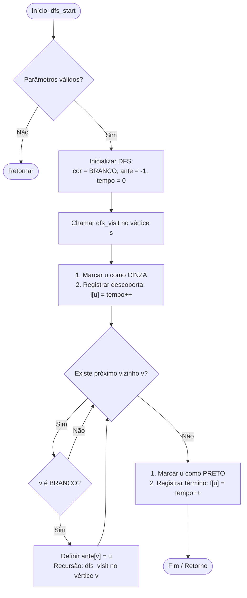

> [!IMPORTANT]
> **Nome obrigatório do repositório**
>
> Ao criar seu repositório usando este template, utilize:
> `implementacao-DFS-[nome-do-aluno]`
>
> Substitua `[nome-do-aluno]` pelo seu nome, sem espaços ou acentos e usando hífens quando necessário.
> Exemplo: `implementacao-DFS-marcos-canejo`
---

## Instruções

Implemente o algoritmo DFS (Busca em Profundidade) a partir das declarações nos arquivos de cabeçalho (`.h`) presentes na pasta `src/`.

A busca deve ser compatível com duas representações computacionais de grafos:
1. **Matriz de Adjacência** (`src/matriz/`).
2. **Lista de Adjacência** (`src/lista/`).

> [!IMPORTANT]
> **Não altere as assinaturas das funções nos arquivos `.h`**. Qualquer alteração nestes arquivos resultará na invalidação da submissão.

---

## Estados dos Vértices (Cores)

Durante o percurso, cada vértice passa por três estados:
- **`BRANCO` (-1)**: Vértice ainda não descoberto/visitado.
- **`CINZA` (0)**: Vértice descoberto e em processamento (está na pilha de recursão).
- **`PRETO` (1)**: Vértice concluído (todos os seus vizinhos e descendentes já foram explorados).

O diagrama abaixo ilustra o fluxo de execução do algoritmo (válido tanto para a busca via matriz quanto via lista de adjacência):

